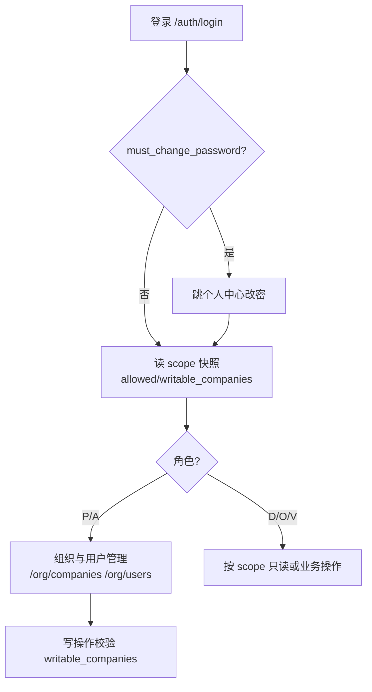
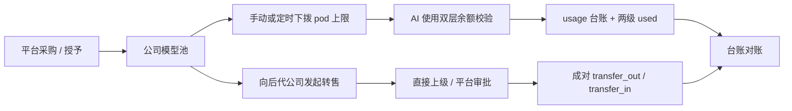

# 业务流程图

> 所属模块: [docs/ui/](README.md)

每个业务域一张流程图, 描述前端主线操作流(用户从哪进、走哪几步、调哪些接口、受什么权限约束). 域划分和 [数据模型/README](../../../iot_server_backend/docs/数据模型/README.md) 对齐. 骨架已列全部域, 逐域补 mermaid; 复杂图建议用 `skills/mermaid` 生成后回填.

## 租户、用户与权限

范围: `companies` / `users` / `company_dashboard_config` / `api_keys` / 审计. 关键流程: 登录 → 强制改密 → scope 快照 → 组织/用户管理.

> 待细化: 多组织切换(`/authorization/contexts` + `/auth/switch-organization`)、角色调整禁改自身.

## 地点与行政区划

范围: `locations` / `districts`. 关键流程: 位置新增/编辑(P/A/D) → 绑定到主机/单元. 待画.

## 主机、节点与接入

范围: `hosts` / `nodes` / `hn_models` / `hn_bindings` / `device_*`. 关键流程: 出厂登记 → 设备接入/认领 → 主机-节点绑定 → 一机一密凭证. 待画.

## 静音仓与拓扑

范围: `pods` / `pod_models` / `pod_topology_*` / `pod_status` / `pod_records`. 关键流程: 建单元 → 装配拓扑版本 → 上线运行 → 遥测/状态展示 → 退役. 待画.

## OD、固件与 OTA

范围: `hn_model_od` / `od_snapshots` / `firmwares` / `ota_tasks`. 关键流程: 固件入库 → 创建 OTA 任务 → 下发 → 进度/回执. 待画.

## 文件与界面

范围: `files` / `file_relations` / `file_deployments`. 关键流程: 上传 → 关联业务对象 → 部署到主机 → 授权可见. 原 standalone Markdown `manuals` 已下线；PDF 用户手册绑定型号的新机制待设计. 待画.

## 会议预约

范围: 预约核心 `pod_booking_*`，第三方集成 `meeting_*`. 关键流程: 集成配置 → 会议室映射 → 预约 → 派发 → 事件回执. 待画.

## 诊断、日志与报告

范围: `diagnostic_sessions` / `can_trace_events` / `serial_logs` / `emcy_logs` / `alert_events`. 关键流程: 发起远程诊断 → 抓包/日志 → 按需 AI 响应；确定性异常 → 结构化告警. `ai_reports` 已删除.

## AI 语音 token 计费（后端已落地）

前端应使用 `/api/v1/ai-tokens`，不得直接计算或覆盖余额。后端已完成事务和 scope，模型目录、余额、流水、补额规则及转售审批页面待前端接入。
